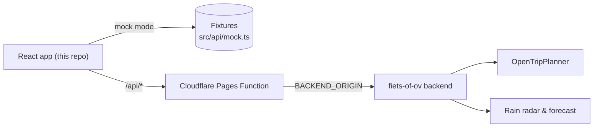

# Fiets of OV — frontend

[](https://github.com/rospocroccante/fiets-of-ov-frontend/actions/workflows/deploy.yml)


Rain-aware bike vs public-transport advice for Amsterdam. The app routes both
options, checks the rain along your ride, and says which one gets you there dry
and fast — with both drawn on the map.

Live: https://fiets.89.125.35.116.sslip.io/

## What it does

- Rain-aware verdict — "Bike — dry during your 17-min ride", not just travel times
- Both options on the map: legs, stops, times, live rain radar and wind
- Phone-first installable PWA; mock mode runs fully offline
- Light and dark theme, contrast floors pinned by tests
- English and Dutch

## Quickstart

```bash
npm install
npm run dev     # http://localhost:5173 — mock mode, no .env needed
```

Without a `.env` the dev server answers from fixtures and shows a "mock" badge in
the corner. Point it at a real backend with `.env` (see below).

## How it fits together



## Configuration

Two build-time variables, both documented in `.env.example` (CI keeps it honest):

| Variable | Values | Meaning |
| --- | --- | --- |
| `VITE_API_MODE` | `mock` \| `live` | Fixtures with a corner badge, or the real backend |
| `VITE_API_BASE` | `/api` \| `https://…` | Same-origin proxy, or direct calls (backend needs CORS) |

`npm run build` refuses an unconfigured or unservable combination, so a demo build
cannot silently masquerade as live. Details in
[DEVELOPMENT.md](DEVELOPMENT.md#configuration).

## Scripts

| Command | What it does |
| --- | --- |
| `npm run dev` | Dev server with `/api` proxy to `localhost:8008` |
| `npm run check` | Everything CI runs: typecheck + lint + tests + build, offline, seconds |
| `npm run test:browser` | Real-Chromium suite: mobile gestures, WebGL basemap |
| `npm run build` | Production bundle (requires explicit `VITE_API_MODE`) |

Enable the pre-commit hook once per clone: `git config core.hooksPath .githooks`

## Deployment

- Demo, no backend — `VITE_API_MODE=mock npm run build`, upload `dist/` to any
  static host
- Live — push to `main`: GitHub Actions builds and deploys to Cloudflare Pages,
  where the Pages Function `functions/api/[[path]].js` proxies `/api/*` to the
  backend (no CORS; the backend URL never enters the bundle)

Setup and failure modes: [DEVELOPMENT.md](DEVELOPMENT.md#deployment).

## Documentation

| Doc | For |
| --- | --- |
| [GUIDE.md](GUIDE.md) | Users — planning trips, reading the verdict, radar, alerts |
| [DEVELOPMENT.md](DEVELOPMENT.md) | Developers — config, deploys, mobile contract, basemap, night palette, tests |
